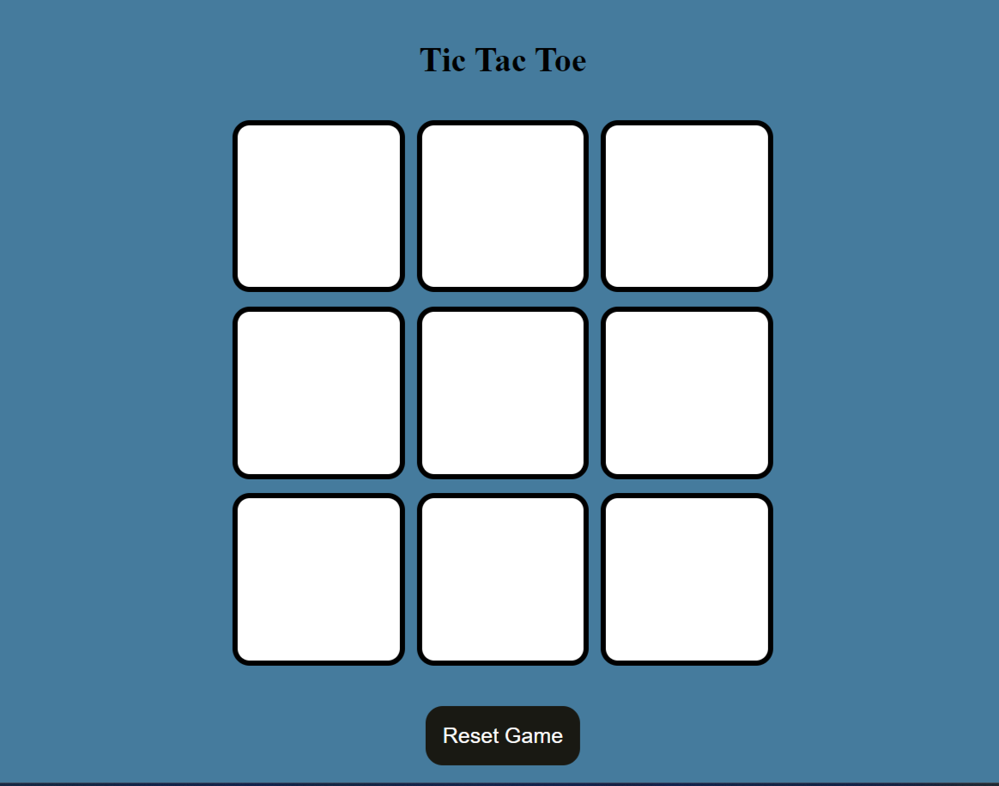
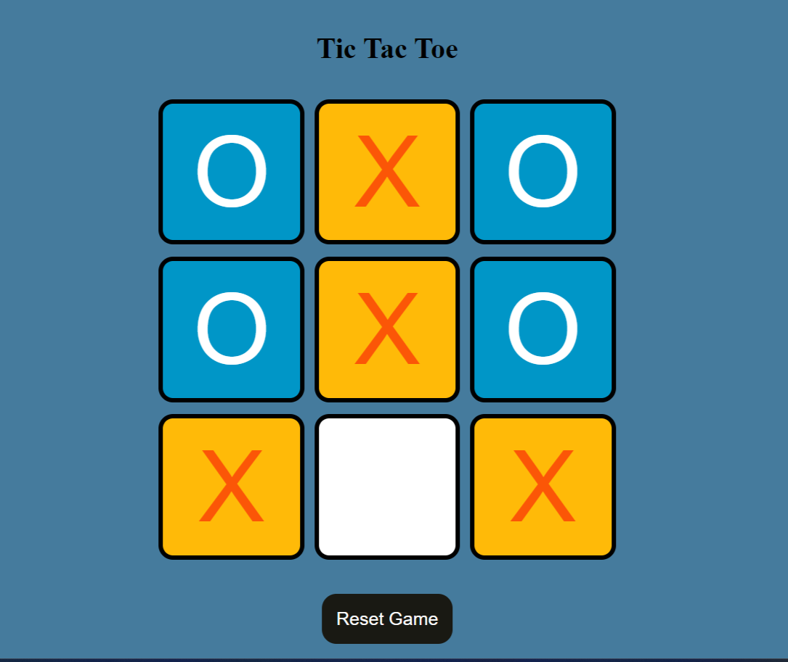
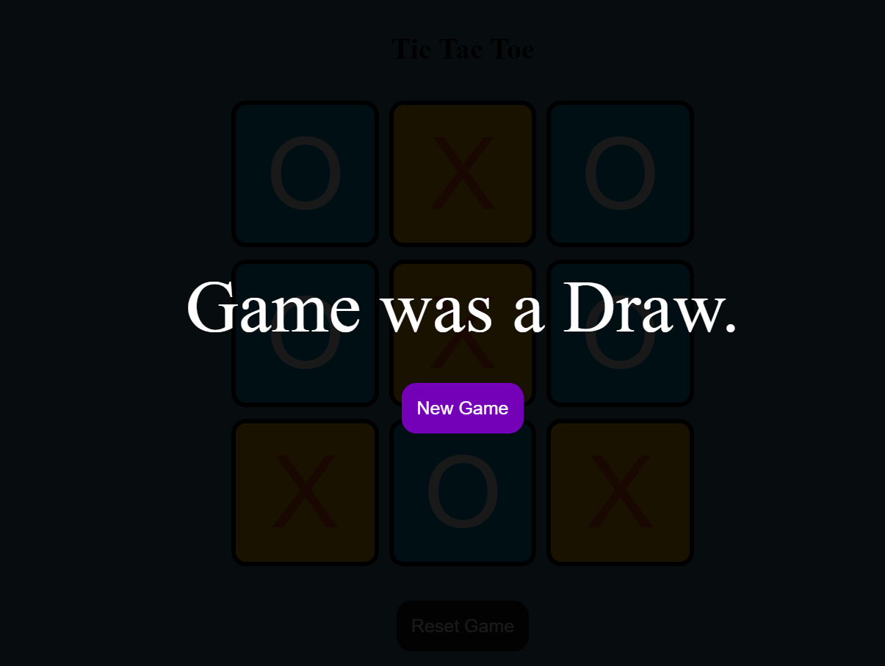

# TicTacToe-Game
## Description
A simple implementation of the classic Tic Tac Toe game using HTML, CSS, and JavaScript. This project provides a two-player experience for users to play and enjoy the game.

## Features
- **Classic Gameplay:** Follows the traditional rules of Tic Tac Toe.
- **Two-Player Mode:** Allows two players to take turns on the same device.
- **Responsive Design:** Ensures a seamless experience on various devices.
- **CSS Styling:** Custom styling for an appealing and user-friendly interface.
- **Game Status Display:** Informs users about the current game status (e.g.,winner, or a draw).
- **Reset Functionality:** Option to reset the game and start a new match.

## Technologies Used
- HTML
- CSS
- JavaScript

## How to Play
1. Clone the repository to your local machine.
   git clone https://github.com/Pothu-Abhilash/Tic-Tac-Toe-Game
2. Open the index.html file in your preferred web browser.
3. Take turns with another player by clicking on the board to place your symbol (X or O).
4. Enjoy the game!
   
## Screen Shots

  
  
  

## Future Enhancements
- Implementing an AI opponent for single-player mode.
- Adding customizable game settings (e.g., board size, symbols).

## Acknowledgments
- Inspiration from the classic Tic Tac Toe game.
